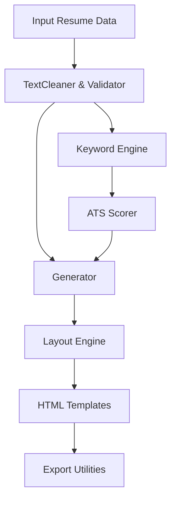

# Cybersecurity Resume Builder

AI-driven, ATS-optimised resume builder tailored for cybersecurity roles. Generates recruiter-ready resumes, scores them for ATS compatibility, and surfaces keyword-strengthening suggestions across multiple layouts.

## Key Capabilities
- **Role-aware intelligence**: keyword extraction, clustering, and prioritisation for cloud, SOC, red team, GRC, DFIR, and more.
- **ATS scoring**: evaluates coverage, impact density, readability, and role relevance with actionable weaknesses.
- **Multi-template rendering**: modern and corporate HTML templates with a plug-in registration mechanism.
- **Improvement hints**: automatically recommends missing or low-frequency keywords to strengthen targeting.
- **Safe defaults**: sanitized, fictional sample data only—no personal information is stored.

## Quick Start
1. Install dependencies:
   ```bash
   npm install
   ```
2. Generate a sample resume (HTML output in `output/resume.html`):
   ```bash
   npm start
   ```
3. Switch templates by setting `RESUME_LAYOUT`:
   ```bash
   RESUME_LAYOUT=corporate npm start
   ```
4. Run quality gates locally:
   ```bash
   npm test
   npm run lint -- --max-warnings=0
   npm run format -- --check
   ```

## Usage
- Programmatic API:
  ```javascript
  import { generateResume } from "./src/core/generator.js";
  const { html, score, suggestions } = await generateResume({
    name: "Alex Candidate",
    targetRole: "Cloud Security Engineer",
    layout: "modern",
    skills: ["AWS", "IAM", "Terraform", "SOAR"],
  });
  ```
- Extend templates by adding files under `src/templates` and registering them via `registerTemplate` in `src/core/layoutEngine.js`.
- Export Markdown via `exportMarkdown` in `src/utils/pdfExport.js`.
- Use the sample payload in `examples/resume.sample.json` as a starting point for new resumes.

### Development Container
- A Dev Container definition (`.devcontainer/devcontainer.json`) pins Node.js 20, installs dependencies on start, and recommends ESLint/Prettier extensions for consistent formatting.

## Repository Structure
- `src/core` – generator orchestration, ATS scorer, keyword intelligence, layout engine
- `src/templates` – HTML resume layouts (modern, corporate)
- `src/utils` – logging, validation, text cleaning, and export helpers
- `public` – static landing page assets
- `examples` – ready-to-run sample payloads for generation
- `docs` – architecture, API, and usage documentation
- `tests` – automated coverage of generation, scoring, and layout flows

## Architecture


See detailed design in [`docs/ARCHITECTURE.md`](docs/ARCHITECTURE.md) and the API in [`docs/API.md`](docs/API.md).

## Quality Gates
- `npm test` – executes Node test runner suites including security escaping checks.
- `npm run lint` – runs ESLint with Prettier compatibility.
- CI runs the same checks on pull requests (see `.github/workflows/ci.yml`).

## Security & Privacy
- Sanitizes and HTML-escapes free text inputs; templates fall back safely when misconfigured.
- Uses fictional defaults unless explicit user data is provided.
- Vulnerabilities: follow the guidance in [`SECURITY_POLICY.md`](SECURITY_POLICY.md).

## Contributing
Refer to [`CONTRIBUTING.md`](CONTRIBUTING.md) for workflow, code style, and security expectations. Be respectful—see [`CODE_OF_CONDUCT.md`](CODE_OF_CONDUCT.md).
Developers can find day-to-day practices and extensibility tips in [`docs/DEVELOPMENT.md`](docs/DEVELOPMENT.md).

## License
MIT License. See [`LICENSE`](LICENSE).
