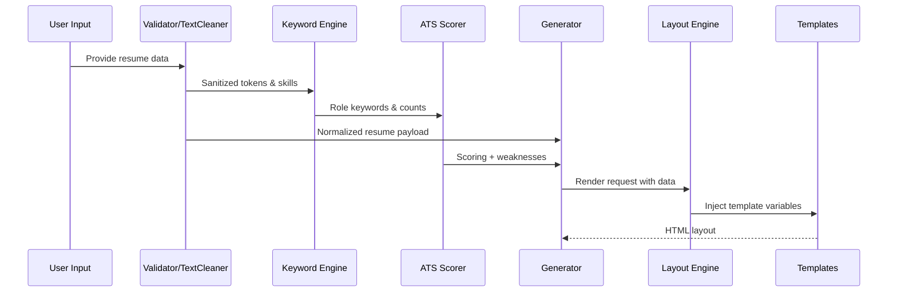

# Architecture Overview

The Cybersecurity Resume Builder is composed of small, extensible modules designed for plug-and-play templates, scoring, and keyword logic.

## Components
- **Generator (`src/core/generator.js`)**: orchestrates data validation, skill clustering, ATS scoring, and layout rendering.
- **Keyword Engine (`src/core/keywordEngine.js`)**: extracts and prioritizes cybersecurity terms, clusters skills, and provides strengthening suggestions.
- **ATS Scorer (`src/core/atsScorer.js`)**: computes ATS-oriented scoring (coverage, impact, readability, role relevance) with explainable weaknesses.
- **Layout Engine (`src/core/layoutEngine.js`)**: loads and injects templates; supports registration of new layouts without changing core logic.
- **Utilities (`src/utils`)**: text cleaning, export helpers, logging, and input validation.

## Data Flow

## Extensibility Hooks
- Add templates to `src/templates` and call `registerTemplate`.
- Extend `ROLE_KEYWORDS` in `keywordEngine` for new specialties.
- Swap export methods in `pdfExport` for production-grade PDF creation.
- Implement additional scorers under `src/core` and compose them in `generator`.

## Error Handling & Logging
- All public entrypoints validate and sanitize input via `validator.js` and `textCleaner.js`.
- `Logger` provides timestamped logs for generator and layout actions to simplify debugging and observability.

## Testing Strategy
- Node's built-in test runner validates keyword extraction, scoring, generation, and layout fallback.
- Tests live under `tests/` and should cover new templates, scorers, or keyword domains as they are added.
